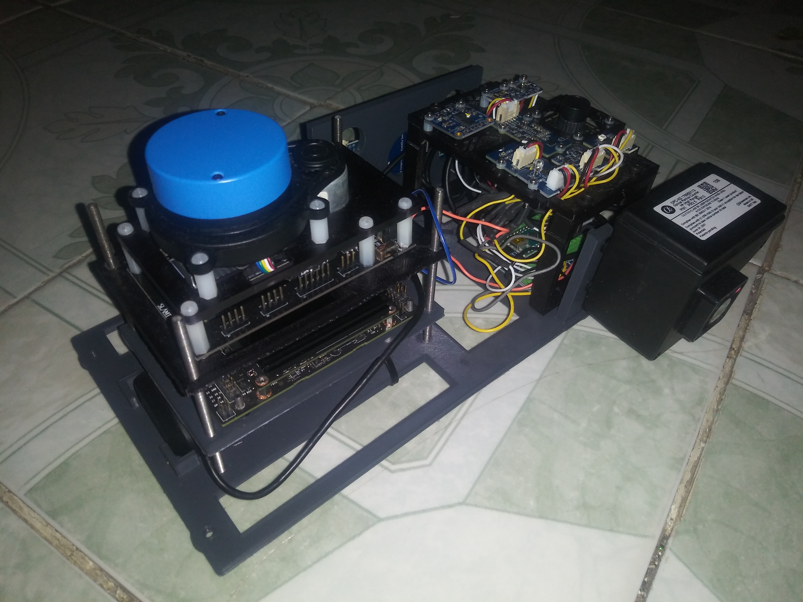

# mints_sensor_pkg
Robot Operating System (ROS) package for communicating with a preassembled array of environmental sensors. Sensors are calibrated using a variety of machine learning approaches, including naive bayes models and random forests. Package takes in data from multiple sensor arrays and displays the incoming data in real time using rqt_multiplot.

# What I've Learned
* How to use ROS in order to organize projects into reusable blocks.
* How to use the Robot Operating System (ROS) in order to send and recieve data over a network
* How to visualize data in real time using rqt_plot
* How to use machine learning to improve the performance of low-cost sensors, allowing them to perform comparably to their more expensive counterparts. 

# Onboard Sensors (Tentative)
* Adafruit VEML6070 UV Sensor Breakout (https://learn.adafruit.com/adafruit-veml6070-uv-light-sensor-breakout)
* Adafruit AS7262 6-Channel Visible Light / Color Sensor Breakout (https://www.adafruit.com/product/3779)
* VCNL4010 Proximity/Light sensor (https://www.adafruit.com/product/466)
* TTL Serial Camera
* USB GPS Antenna 
* Slamtec Mapper (https://www.slamtec.com/en/Lidar/Mapper)

# Contributions
* Aaron Barbosa | Assembling sensor arrays and integrating ROS compatibility. 
* Lakitha Wijerante and Daniel Kiv | Acquiring training data and training machine learning models
